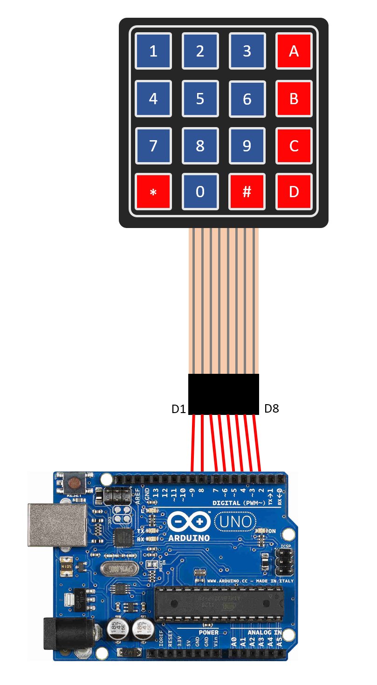

# Arduino Deck

multi functional deck with an arduino and a 4x4 keypad.

## Main idea

The `deck.py` program listens on a port then run a sequence of commands for each character witch was readed from serial port.

## How to use this application ???

By default you need an arduino board with a 4x4 keypad But actually you can create and use your own hardware witch sends characters over serial port to your computer.

In this case i have setup my arduino and keypad like this :



After setting up hardware [write your own profiles]() for each key of the keypad or what ever you use.

Now just run the `deck.py` and enjoy ***ت***

### Main staps :

1. Connect arduino board to the keypad like above image.
1. Upload `keypad_to_serial.ino` in to your arduino board. [How ???]()
1. Write your personal profile files in the profiles folder.
1. Execute `deck.py` and enjoy.

## Requirements

1. `Keypad` library for arduino from Mark Stanley, Alexander Brevig varsion 3.1.1 .

\* Hardware setup from : https://www.instructables.com/Arduino-Keypad-4x4-Tutorial/

1. `pynput` for python .

## Writing profiles

In the profiles folder you can how many profiles you want and you need.

The `defprofile` file contains the name of default profile to use when running the program for first time so don't forget to write the name of your starting profile here.

But keep it in mind after changing profile with commands this file will be changed so it is better to say that this file contains last profile used with application.

### Commands

\* names between brakets [] are variable and you should change them accourding to your needs.

\* also remove brakets.

1.
> ***\>[portname]***

example : `>COM3`

Use this port to communicate with hardware and read characters.

2.
> ***\>[a character]***

examples :  `>A`	`>B`	`>3`

Execute all lines under this line (until a line like this) after pressing `A` character is keypad (or technicaly after receiving this character).

3.
> ***Lines started with a # and empty lines will be ignored***

example : `# this is a comment`

4.
> ***\<[profile file name]***

example : `<profile3.txt`

Change the profile to given profile.

\* the profile file should be at `/profiles` folder.

\* don't use absolute pathes only tha name of files without any slashs or other characters.

5.
> ***\>***

example : `>`

Yes only a `>` is a command !

This acts like command number 2 but the difference is the lines under this line will be execute after pressing any key (or receiving any character from serial port).

6.
> ***type:[some thing]***

example : `type:hello all i'am using a greate program from saadati944 !!!`

This is only command you can use spaces after `:`

7.
> ***sleep:[secconds]***

example : `sleep:0.1` means sleep for 100 millisecconds.

Do nothing for given secconds.

8.
> ***down:[a key name]***

examples : `down:enter` `down:a`

Hold given key down.

9.
> ***up:[a key name]***

examples : `up:enter` `up:a`

Release given key.

10.
> ***goto:[X],[Y]***

example : `goto:100,100`

Quickly set mouse position to X, Y.

11.
> ***move:[X],[Y]***

example : `move:234,567`

Move mose cursor to X, Y.

12.
> ***click:left***

Emulate a left click with mouse.

13.
> ***click:right***

Emulate a right click with mouse.

14.
> ***click:middle***

Emulate a middle click with mouse.

15.
> ***mousedown:left***

Hold mouse left key down.

16.
> ***mousedown:right***

Hold mouse right key down.

17.
> ***mousedown:middle***

Hold mouse middle key down.

18.
> ***mouseup:left***

Release mouse left key.

19.
> ***mouseup:right***

Release mouse right key.

20.
> ***mouseup:middle***

Release mouse middle key.

21.
> ***exit***

exit program.


#### example :

Here is a simple example accourding to my own 4x4 keypad and.

```
# use com3 serial port
>COM3

# press command key (windows key) after pressing '#'
>#
down:cmd
up:cmd

#open notepad and write some text in it after pressing 'A'
>A
# windows + s 
down:cmd
down:s
up:s
up:cmd

#wait 0.5 secconds
sleep:0.5

# write notepad
type:notepad.exe

# wait 0.5 secconds
sleep:0.5

# press enter to run notepad program
down:enter
up:enter

# wait 0.5 secconds
sleep:0.5

# type something...
type:hey it works fine !!!.


# move mouse courser to 0,0 then
# change profile to 'counter strike.txt' after pressing 0
>0
move:0,0
<counter strike.txt

# do nothing for these keys.
# also it is possible to don't write these headers.
>B
>C
>D
>*
>1
>2
>3
>4
>5
>6
>7
>8
>9


```